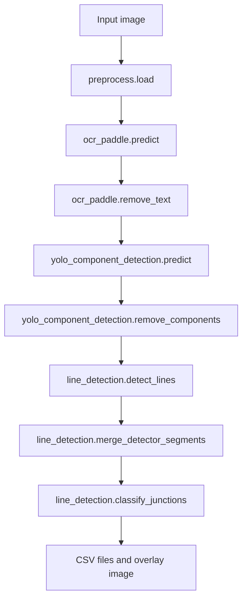

# Diagram Intelligence Pipeline

This document describes the current diagram-processing pipeline in this repository (as of 9/18/26 1.21 pm). The pipeline takes a circuit or engineering diagram image, removes visual elements that should not be interpreted as wiring, detects text and components, detects line segments from the cleaned image, merges fragmented segments, and classifies junctions.

## Pipeline At A Glance



The intended order is important:

1. Load the original image.
2. Detect and remove text so character strokes are not mistaken for wires.
3. Detect and remove diagram components so component outlines are not mistaken for wire segments.
4. Detect lines on the remaining image.
5. Merge fragmented detections that represent one physical wire.
6. Classify nodes where wires meet.
7. Save machine-readable results and a visual overlay for inspection.

The line stage is deliberately independent of OCR and YOLO implementation details. It accepts the image returned by the preceding cleaning stages. This makes it compatible with the current pipeline while avoiding unnecessary imports of PaddleOCR and Ultralytics in the line detector.

## Repository Locations

| Stage | Location | Main API |
|---|---|---|
| Image loading | [`src/image/preprocess.py`](src/image/preprocess.py) | `read_grayscale`, `load` |
| PaddleOCR text detection/removal | [`src/image/text_extraction.py`](src/image/text_extraction.py) | `ocr_paddle.predict`, `ocr_paddle.remove_text` |
| YOLO component detection/removal | [`src/image/component_detection.py`](src/image/component_detection.py) | `yolo_component_detection.predict`, `yolo_component_detection.remove_components` |
| OpenCV line and junction stage | [`src/image/line_detection.py`](src/image/line_detection.py) | `run_line_detection` and helper functions |
| Experiment notebook | [`src/image/line_detection.ipynb`](src/image/line_detection.ipynb) | Detector comparison and parameter experiments |
| Generated line outputs | [`output/line detection`](output/line%20detection) | CSV and PNG artifacts |

The module path is `image.line_detection` when the `src` directory is on the Python path, matching the existing imports such as `from image import preprocess`.

## Stage 1: Image Loading

### `read_grayscale(path)`

**Definition:** `src/image/preprocess.py`, function `read_grayscale`.

**Purpose:** Check whether a path exists and load it with OpenCV.

**Usage:** Called internally by `preprocess.load(path)`.

**Input:** A filesystem path as a string.

**Output:** The OpenCV image returned by `cv2.imread`, or `None` when OpenCV cannot read the file.

**Important implementation detail:** Despite its name, the current function calls `cv2.imread(path)` without `cv2.IMREAD_GRAYSCALE`, so it normally returns a three-channel BGR image. The line stage accepts either BGR or single-channel images and converts BGR to grayscale before detection.

### `load(path)`

**Definition:** `src/image/preprocess.py`, function `load`.

**Purpose:** Provide the pipeline's loading boundary and return an image even when loading fails.

**Usage:**

```python
from image import preprocess

image = preprocess.load("path/to/diagram.png")
```

**Output:** A loaded OpenCV image, or an empty `uint8` array with shape `(0, 0)` when loading fails. Callers should validate the result before sending it to OCR or detection.

**Current preprocessing behavior:** The function currently does not threshold, denoise, resize, or normalize the image. The commented threshold operation shows where additional preprocessing could be introduced later.

## Stage 2: Text Detection And Removal

### `ocr_paddle.__init__()`

**Definition:** `src/image/text_extraction.py`, class `ocr_paddle`.

**Purpose:** Initialize PaddleOCR with document orientation, unwarping, and text-line orientation disabled. The environment variables above the import disable PaddlePaddle settings that are problematic for this project environment.

**Usage:**

```python
from image.text_extraction import ocr_paddle

ocr = ocr_paddle()
```

### `ocr_paddle.predict(img)`

**Definition:** `src/image/text_extraction.py`, method `ocr_paddle.predict`.

**Purpose:** Run PaddleOCR and return its structured result. Grayscale input is converted to BGR because PaddleOCR expects an H x W x C image.

**Processing details:**

- Calls `self.ocr.predict(img)`.
- Saves PaddleOCR JSON output to `output` using PaddleOCR's `save_to_json` method.
- Reads the result JSON when PaddleOCR returns it as a string.
- Extracts `res.rec_boxes` and `res.rec_texts`.
- Removes detections whose text contains `ww`, because the current project treats those detections as likely resistor artifacts rather than useful text.

**Output:** A dictionary containing a `res` object. The important field for removal is `data["res"]["rec_boxes"]`, where each box is represented as `[x1, y1, x2, y2]`.

### `ocr_paddle.remove_text(img)`

**Definition:** `src/image/text_extraction.py`, method `ocr_paddle.remove_text`.

**Purpose:** Convert OCR bounding boxes into a binary mask and reconstruct those regions with OpenCV Telea inpainting.

**Usage:**

```python
cleaned_text_image, ocr_data = ocr.remove_text(image)
```

**Processing details:**

- Creates a zero-valued mask with the same height and width as the image.
- Marks every OCR rectangle as 255.
- Calls `cv2.inpaint(img, mask, 1000, cv2.INPAINT_TELEA)`.
- Returns both the text-cleaned image and OCR data.

**Output:** `(cleaned_image, ocr_data)`. The cleaned image is the input to component detection. The OCR data can be retained for later semantic interpretation.

### Alternative Tesseract functions

The same file also defines `text_extract(img)`, `draw_ocr(img, data)`, and `remove_text(img, data)` for a Tesseract DataFrame-based path. These functions are not required by the PaddleOCR path above. The Tesseract remover expands each box by two pixels and uses an inpaint radius of five, while the PaddleOCR class currently uses its own box handling and inpaint radius of 1000.

## Stage 3: Component Detection And Removal

### `yolo_component_detection.__init__(path)`

**Definition:** `src/image/component_detection.py`, class `yolo_component_detection`.

**Purpose:** Load the trained Ultralytics YOLO model from a checkpoint path.

**Usage:**

```python
from image.component_detection import yolo_component_detection

components = yolo_component_detection("best.pt")
```

### `yolo_component_detection.predict(img)`

**Definition:** `src/image/component_detection.py`, method `yolo_component_detection.predict`.

**Purpose:** Run the YOLO model on an image and return Ultralytics result objects.

**Output:** A list-like Ultralytics result collection. The first result, `self.predict(img)[0]`, contains the detected bounding boxes.

### `yolo_component_detection.draw_yolo(img)`

**Definition:** `src/image/component_detection.py`, method `yolo_component_detection.draw_yolo`.

**Purpose:** Create a visual diagnostic image by drawing each predicted component rectangle, class label, and confidence.

**Pipeline role:** This is a visualization helper. It does not remove components and should be used on a copy of an image when the original pixels must be preserved.

### `yolo_component_detection.remove_components(img)`

**Definition:** `src/image/component_detection.py`, method `yolo_component_detection.remove_components`.

**Purpose:** Hide detected component regions before line detection while preserving crossover and terminal symbols because they represent wiring topology.

**Processing details:**

- Runs YOLO prediction.
- Computes the per-channel median of the image as a background color.
- Preserves detections whose normalized class name is `crossover`, `terminal`, or `terminals`.
- Flushes `output/components temp/` at the start of every run so crops belong only to the latest run.
- Copies every other detected component crop to `output/components temp/`.
- Replaces every other detected `[x1, y1, x2, y2]` region with that background color.

**Usage:**

```python
line_input, yolo_result = components.remove_components(cleaned_text_image)
```

**Output:** `(image_without_components, yolo_result)`. The first item is the image passed to `run_line_detection`.

**Mutation note:** The function writes directly into the supplied image array. Pass a copy when the text-cleaned image must also be retained:

```python
line_input, yolo_result = components.remove_components(cleaned_text_image.copy())
```

Removed component crops are named with a zero-padded index and class, for example `0000_and.png`. The temporary folder is created relative to the current working directory and is intended for inspection during a pipeline run.

## Stage 4: Line Detection And Junction Classification

The implementation is in [`src/image/line_detection.py`](src/image/line_detection.py). The selected detector is OpenCV Fast Line Detector (FLD), with OpenCV LSD as a compatibility fallback when `cv2.ximgproc.createFastLineDetector` is unavailable. This choice matches the experimental notebook decision.

### `as_segments(value)`

**Definition:** `src/image/line_detection.py`, function `as_segments`.

**Purpose:** Normalize the different OpenCV detector output shapes into a consistent `N x 4` NumPy array.

**Output contract:** Each row is `[x0, y0, x1, y1]` with `float32` values. `None` becomes an empty `(0, 4)` array.

### `detect_lines(image, detector="fld")`

**Definition:** `src/image/line_detection.py`, function `detect_lines`.

**Purpose:** Detect raw line segments from the component- and text-cleaned image.

**Processing details:**

- Validates that the image is not empty.
- Accepts either BGR or grayscale input.
- Converts BGR input to grayscale.
- Uses `cv2.ximgproc.createFastLineDetector()` for `detector="fld"` when available.
- Uses `cv2.createLineSegmentDetector(cv2.LSD_REFINE_STD)` for LSD fallback or `detector="lsd"`.

**Output:** `(detector_name, raw_segments)`, for example `("opencv_fld", array)`.

### `segment_geometry(segment)`

**Definition:** `src/image/line_detection.py`, function `segment_geometry`.

**Purpose:** Calculate the geometric basis used during merging.
2. A perpendicular normal vector.
3. The segment midpoint.


**Definition:** `src/image/line_detection.py`, function `merge_detector_segments`.

**Purpose:** Convert fragmented detector output into longer physical line candidates.

**Merge criteria:** Two segments merge when all of these conditions hold:

- Their direction angle differs by at most five degrees.
- Their perpendicular midpoint offset is at most seven pixels.
- Their projected gap along the current line direction is at most fourteen pixels.

The algorithm repeatedly absorbs compatible pending segments, projects endpoints onto the current direction, and rebuilds one segment spanning the combined projection range. It processes one detector's output at a time; FLD and LSD results are never combined.

### `point_segment_distance(point, segment)`

**Definition:** `src/image/line_detection.py`, function `point_segment_distance`.

**Purpose:** Determine whether a candidate node lies close enough to a segment to contribute a ray.

**Output:** `(distance, parameter)`, where `parameter` is clamped to `[0, 1]` and identifies whether the node is near an endpoint or in the interior.

### `segment_intersection(first, second)`

**Definition:** `src/image/line_detection.py`, function `segment_intersection`.

**Purpose:** Find crossing points between finite, non-parallel segments. Intersections are added to the node candidates so junctions can be classified even when a detector segment crosses another segment away from its endpoints.

**Output:** An intersection coordinate or `None` for parallel/non-intersecting segments. A small parameter tolerance of `0.03` allows near-endpoint intersections to survive rasterization error.

### `cluster_points(points, radius=10)`

### `classify_junctions(segments, radius=10, angle_tolerance=18)`

**Definition:** `src/image/line_detection.py`, function `classify_junctions`.

**Purpose:** Convert merged lines into junction records.

**Processing details:**

- Uses all segment endpoints and pairwise intersections as node candidates.
- Clusters candidates within ten pixels.
- Finds rays from each node to nearby segment ends or interior points.
- Treats rays within eighteen degrees as the same direction.
- Counts the remaining unique directions.

**Classification rules:**

- Four or more rays: `+` junction.
- Exactly three rays: `T` junction.
- Exactly two rays separated by 45 to 135 degrees: `L` junction.
- Two nearly collinear rays and one-ray nodes are discarded.

**Output:** A pandas DataFrame with columns `x`, `y`, `type`, and `degree`.

### `draw_detection_overlay(image, segments, junctions)`

**Definition:** `src/image/line_detection.py`, function `draw_detection_overlay`.

**Purpose:** Produce a visual diagnostic image.

**Rendering:** Merged segments are red. L junctions are blue, T junctions are orange, and `+` junctions are green. The junction type is written beside each marker.

### `save_detection_results(output_dir, detector_name, raw_segments, merged_segments, junctions, overlay)`

**Definition:** `src/image/line_detection.py`, function `save_detection_results`.

**Purpose:** Persist the line-stage outputs for downstream graph construction, evaluation, and visual inspection.

**Files written:**

- `<detector>_raw_segments.csv`: detector output before merging.
- `<detector>_merged_segments.csv`: merged line candidates.
- `<detector>_junctions.csv`: junction coordinates, type, and degree.
- `<detector>_merged_junctions.png`: annotated overlay.
- `selected_detector_comparison.csv`: one-row count summary.

### `run_line_detection(image, output_dir=None, detector="fld")`
- `overlay`: annotated OpenCV image.
- `paths`: saved artifact paths, or an empty dictionary when no output directory was requested.

## End-To-End In-Memory Usage

```python
from image import preprocess
from image.component_detection import yolo_component_detection
from image.line_detection import run_line_detection
from image.text_extraction import ocr_paddle

source = preprocess.load("test/large.jpg")
if source.size == 0:
    raise FileNotFoundError("Could not load the input diagram")

ocr = ocr_paddle()
without_text, ocr_data = ocr.remove_text(source)

components = yolo_component_detection("best.pt")
without_components, yolo_data = components.remove_components(without_text.copy())

line_result = run_line_detection(
    without_components,
    output_dir="output/line detection",
    detector="fld",
)

print(line_result["junctions"])
```

The `ocr_data` and `yolo_data` objects remain available for later association of detected wires with labels and components. The line stage does not discard those upstream results.

## Direct Command-Line Usage

The line module can also run on an already cleaned image:

```powershell
python -m image.line_detection out.png --output-dir "output/line detection" --detector fld
```

The CLI reads the image in grayscale, runs the same public orchestration function, prints counts and junction records, and writes the same artifacts as the in-memory API. Run it from a repository environment where `src` is on `PYTHONPATH`, or use the project's configured editable environment.

## Data Flow And Contracts

| Boundary | Input | Output |
|---|---|---|
| `preprocess.load` | image path | OpenCV image |
| `ocr_paddle.remove_text` | OpenCV image | cleaned image plus OCR dictionary |
| `remove_components` | cleaned OpenCV image | component-free image plus YOLO result |
| `detect_lines` | component-free image | detector name plus `N x 4` segments |
| `merge_detector_segments` | raw segments | merged `M x 4` segments |
| `classify_junctions` | merged segments | `x`, `y`, `type`, `degree` DataFrame |
| `run_line_detection` | component-free image | complete result dictionary |

The coordinate system is the original image coordinate system: `x` increases to the right and `y` increases downward. Segment CSV coordinates and junction coordinates use pixels in that same system.

## Design Decisions And Limitations

- FLD is the selected detector because it was included in the experimental comparison and produced the same 52 raw segments as LSD on the evaluated image.
- LSD fallback keeps the module usable with standard OpenCV installations that do not expose `cv2.ximgproc`.
- Merging is detector-local. Combining multiple detector outputs would duplicate lines and bias junction degree counts.
- Junction classification is geometric, not electrical. A `+` record means four or more geometric rays were observed; it does not prove that the source diagram indicates an electrical connection.
- OCR and YOLO model quality directly affects line quality because text and component pixels must be removed before line detection.
- `component_detection.py` currently replaces YOLO boxes with a median color and mutates its input array. Passing `.copy()` at the integration boundary preserves the prior cleaned image.
- The current `preprocess.load` name suggests grayscale loading but returns the default OpenCV BGR result. `line_detection.detect_lines` handles both representations.
- The current line stage is ready to provide geometric primitives for a later graph-building stage, where endpoints and junctions can become graph nodes and merged segments can become graph edges.
